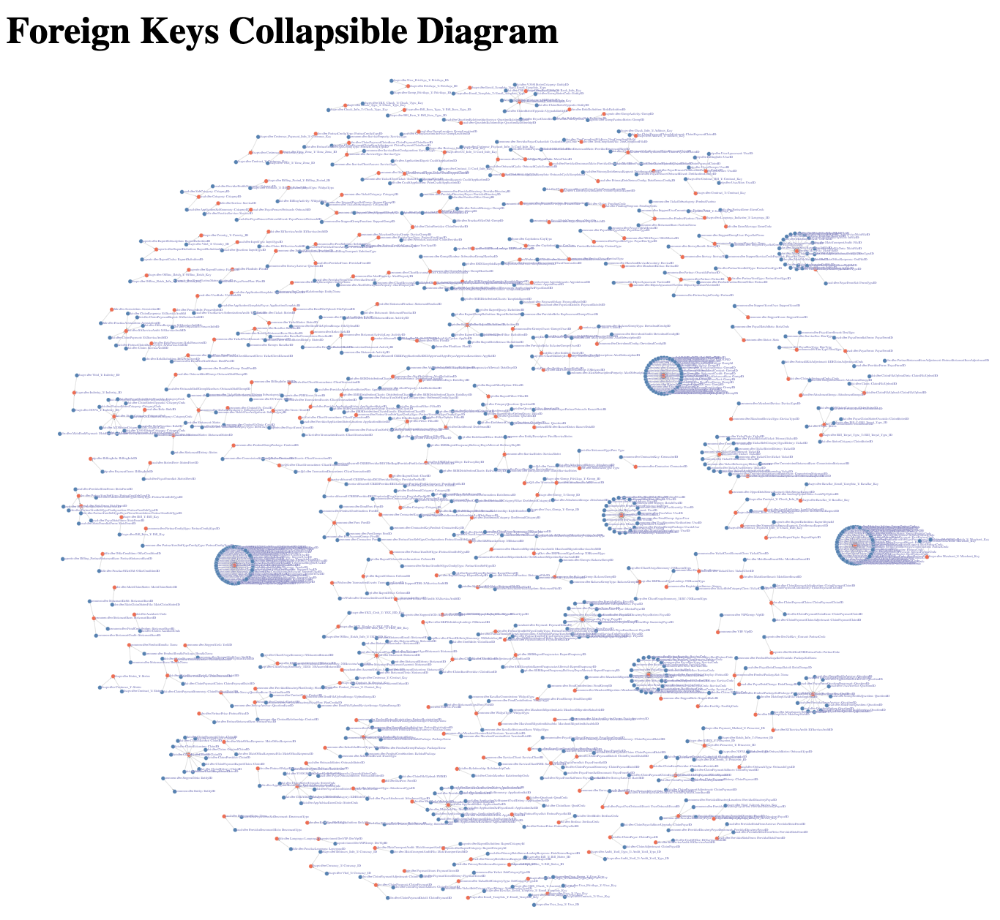

# DXC Schema Analysis

Tools for analyzing DentalXChange's production MS SQL database schemas.

## How to use
First generate analysis data by scanning all schema:
```
./scan-all.sh
```

This will land a set of .json and .csv files into [analysis-dean](/analysis-dean/) and dump out stats to the command line.

These stats as well as the .json and .csv files may be used directly for analysis. They also form the data for 2 vizualizations under the [src](/src) directory, which you can run as follows:
```
./run.sh
```

Of the 2 vizualizations, the Foreign Keys Diagram is perhaps the more useful.

